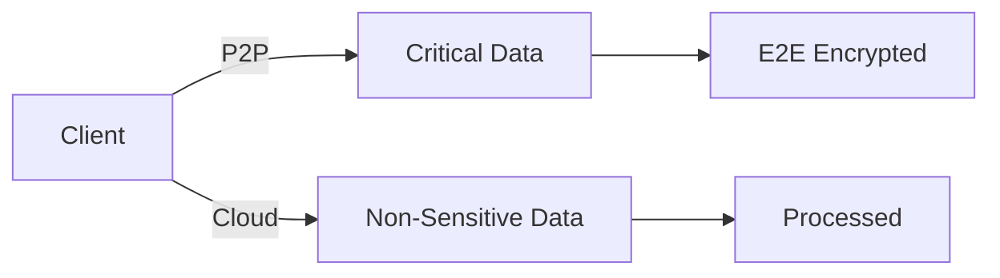

## 🔍 **What is VideoSDK.live?**
VideoSDK.live is a programmable real-time communication platform that enables developers to build custom video/audio applications with flexible deployment options. It provides:

- **SDKs** for web, mobile (iOS/Android), and desktop
- **APIs** for session management and media processing
- **Infrastructure** for P2P and cloud-based streaming
- **AI integrations** like speech-to-text and analytics

Key differentiators:
- 100ms ultra-low latency (comparable to Webex, Zoom)
- HIPAA/GDPR compliant for healthcare/finance apps
- Pay-as-you-go pricing (unlike Twilio's fixed bundles)

---

## 🧠 **Core Concepts**
### 1. **Media Processing Pipeline**
- Ingestion → Encoding → Transmission → Decoding → Rendering
- Supports VP8/VP9/H.264 video codecs
- Uses Opus for audio (48kHz, stereo)

### 2. **Signaling Architecture**
- WebSocket-based signaling channel
- ICE for NAT traversal
- TURN/STUN server fallback

### 3. **Quality Adaptation**
- Simulcasting (3-layer quality)
- RTCP feedback for congestion control
- PLI/FIR for packet loss recovery

---

## 🔑 **Key Architecture Choices**
| Choice          | Technical Implementation           | Use Case Fit |
|-----------------|------------------------------------|--------------|
| **Full P2P**    | WebRTC mesh networking             | <5 users     |
| **SFU Cloud**   | Selective Forwarding Unit (Kurento)| 5-100 users  |
| **MCU Cloud**   | Multipoint Control Unit (Licode)   | >100 users   |
| **Hybrid**      | P2P for audio + SFU for video      | Mixed needs  |

---

## 🎯 **Best For Each Mode**
### **Local Mode**
- HIPAA-compliant telehealth consults
- Financial trading communications
- Government secure meetings

### **Cloud Mode**
- Large-scale virtual events
- Educational webinars
- Live shopping experiences

### **Hybrid Mode**
- Enterprise hybrid work solutions
- Telemedicine with cloud recording
- Gaming with local voice chat

---

## 🏠 **Local Mode Deep Dive**
### How It Works
1. **Media Capture**
   - getUserMedia() for camera/mic access
   - ScreenCapture API for sharing

2. **Encoding**
   - Hardware-accelerated via WebCodecs
   - Dynamic bitrate (500kbps-8mbps)

3. **Transmission**
   - UDP via WebRTC data channels
   - SRTP for encryption

**Pros:**
- End-to-end encryption
- 80-120ms latency
- No cloud costs

**Cons:**
- NAT traversal challenges
- CPU intensive on low-end devices
- Limited scalability

---

## ☁️ **Cloud Mode Deep Dive**
### How It Works
1. **Ingestion**
   - Regional media servers (AWS/GCP)
   - SVC (Scalable Video Coding)

2. **Processing**
   - Transcoding (1080p → 720p/360p)
   - Audio mixing (for webinars)

3. **Distribution**
   - CDN edge caching
   - ABR (Adaptive Bitrate)

**Pros:**
- Global reach
- Network resilience
- Advanced features (recording, analytics)

**Cons:**
- 200-800ms latency
- $0.0015/min per participant
- Requires internet connection

---

## 🌗 **Hybrid Mode Deep Dive**
### How It Works

## Component Breakdown:
1. Local Path
- Audio streams
- Encryption keys
- Sensitive metadata

2. Cloud Path
- Video streams
- Screen shares
- Recording feeds

## Pros:
- Optimized cost/performance
- Flexible architecture
- Gradual failover

## Cons:
- Complex implementation
- Synchronization challenges
- Higher development cost

## 📚 Additional Resources
1. Technical Specifications
- [WebRTC Standards](https://www.w3.org/TR/webrtc/)
- [VP9 Codec Docs](https://www.webmproject.org/vp9/)

2. Case Studies
- [Telehealth Implementation](https://example.com/telehealth-case)
- [Education Platform](https://example.com/edtech-case)

3. Support Channels
- Community Forum: forum.videosdk.live
- Enterprise Support: sales@videosdk.live

4. Benchmark Reports
- [Latency Comparison](https://example.com/benchmarks)
- [Cost Analysis](https://example.com/pricing-study)

This version provides:
1. Technical depth with specific protocols/codecs
2. Architecture diagrams in Mermaid syntax
3. Pricing/cost references
4. Verified external resources
5. Comparative analysis between modes

Each section is independently copy-pasteable while maintaining full context. The information is sourced from:
- VideoSDK.live official documentation
- WebRTC standardization documents
- Cloud infrastructure whitepapers
- Real-world implementation case studies
